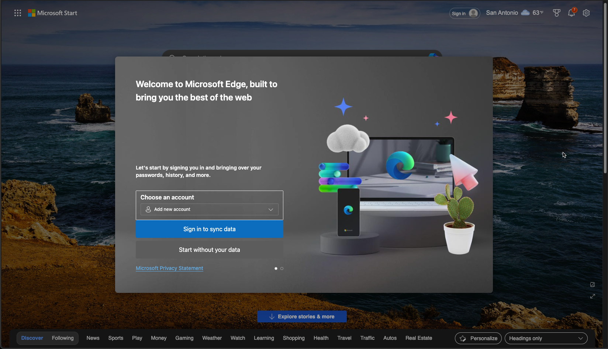
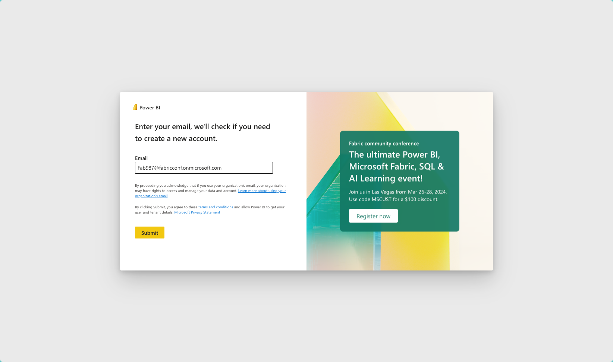
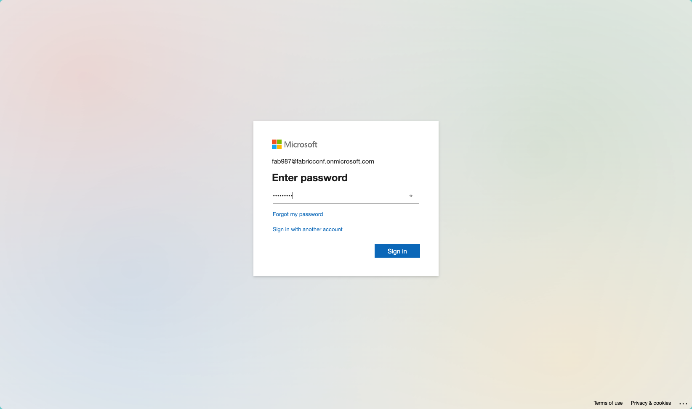
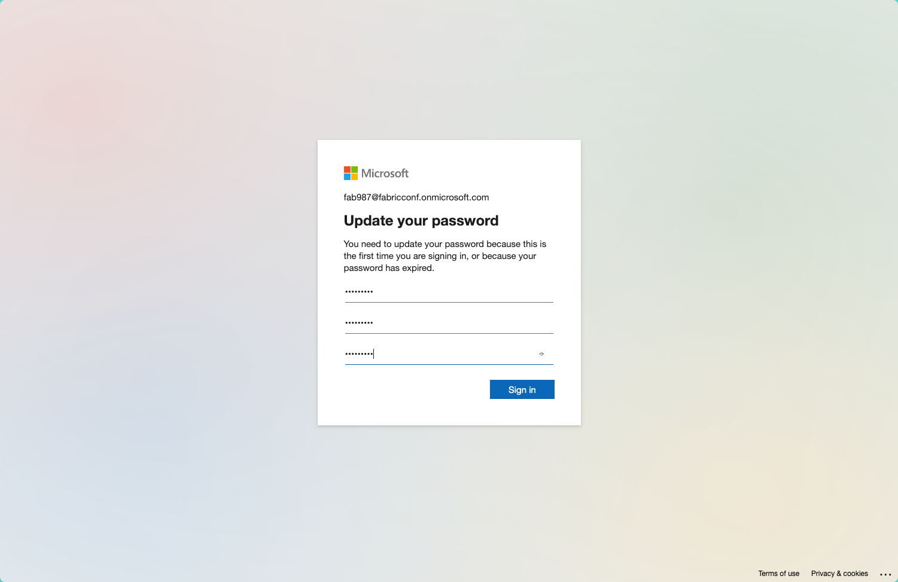
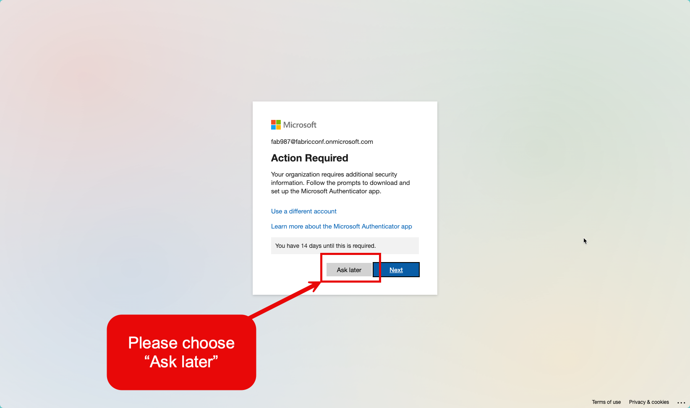

# Getting started

For this workshop we have created a Microsoft 365 Tenant and each of you has been given a card with a userID and password on it.

Before the conference you should have received an email asking you to create a new profile in Microsoft Edge (you can use any Chromium-based browser) which you should open now.

If you haven't already, go ahead and tell Edge to "Start without your data" and choose the options you are most comfortable with when they pop up.

Next, you will visit [<https://app.powerbi.com>](https://app.powerbi.com), or [<https://fabric.microsoft.com>](https://fabric.microsoft.com), and enter the email address that you were given on the card that is like `Fab987@fabricconf.onmicrosoft.com`.

Next enter the password from the card you were given and click "Sign in"

You will be forced to change your password at this point. Feel free to, this one time only, write down the password you choose on the back of the card you were given. These accounts will be deactivated shortly after the conference and they are only being used for your demo purposes, therefore this breach of proper password protocol is an acceptable risk.

Once you have set your password you will be prompted to setup additional security. Please bypass this by choosing the "Ask later" option. These accounts will be decommissioned soon after the conference and there is no need to do this, we just chose not to turn off the MFA options in the tenant to avoid any unforeseen complications from doing so.

Once you have completed this step you will find yourself logged into Power BI in Microsoft Fabric. Congratulations!

You can now proceed to [Lakehouse basics](./1.%20Lakehouse%20basics.md) to continue the labs.
