# Lakehouse Basics

Create a Workspace

Navigate to Fabric Home through Power BI - https://app.powerbi.com

Login with your allocated user ID (Fabxxx@fabricconf.onmicrosoft.com). If required, change the password, and select "Later" to set up multi-factor authentication.

Select Workspaces from the left rail

Select New workspace - Use the name "Fabric Workshop xxx" where xxx is your user number (as in Fabxxx@fabricconf.onmicrosoft.com).

Open the advanced tab and make sure that the License mode is Trial, Premium, or Fabric. If not, set it to one of these.

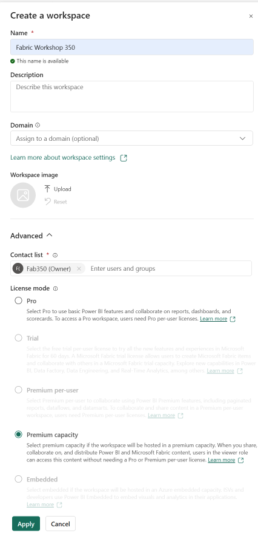

Click the "Apply" button to create the workspace.

> **Taskflows**
>
> When you first enter the workspace, you may see a section for Taskflows. Taskflows can be a great way to follow certain common data patterns. If this is too distracting, you can collapse the Taskflows pane by selecting the carrot icon in the divider pane to collaps and later to show again.
>
>

## Create a Lakehouse

In your new workspace, select the "+ New item" button in the ribbon.

Scroll down to the "Store data" section and select the Lakehouse tile. Or, you can type in *Lakehouse* within the filter box.

Give the Lakehouse a name - use "Lakehouse_Fabxxx" where xxx is your user name. Note that the name can NOT include spaces. Do not check the "Lakehouse schemas" checkbox. Click the "Create" button. Once the lakehouse is created, you will be taken directly to it.

Note the two containers: Files and Tables. Both folders are empty.

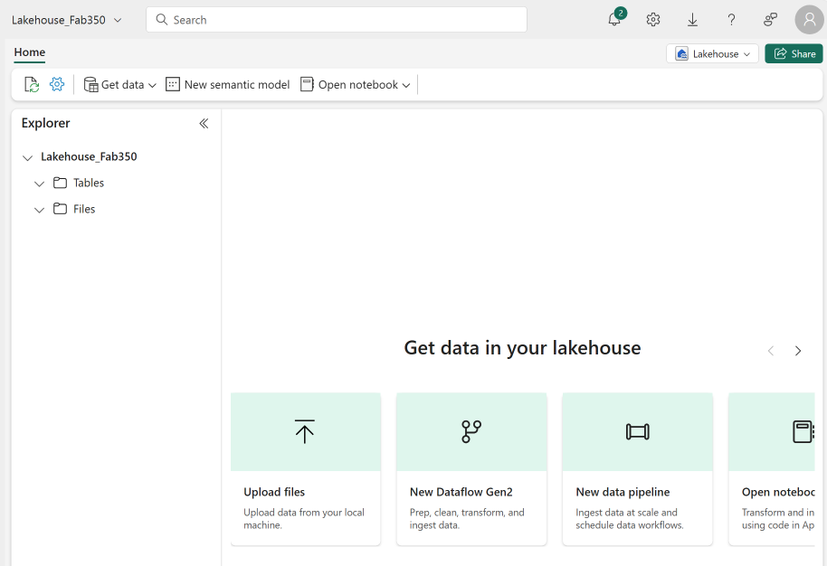

## Add File content

Download all of the CSVs located [here](https://github.com/jasonhimmelstein/FabricForPowerBI/tree/main/Recent%20Thermostat%20Data) to your local device. You can use [GitHub Desktop](https://desktop.github.com/) to clone the repo, download the files individually, or download the .zip file that contains all of the files in the folder. We will be using these files throughout the exercises.

From your Lakehouse, click the ellipsis to the right of the Files container, and select "New subfolder". Name it "Recent thermostat files", and click "Create".

Using the ellipsis to the right of your new subfolder, select "Upload". and upload the CSV for August that you downloaded above. After seeing the green check mark next to the file size you can close the upload files window by clicking the "X" in the top right corner.

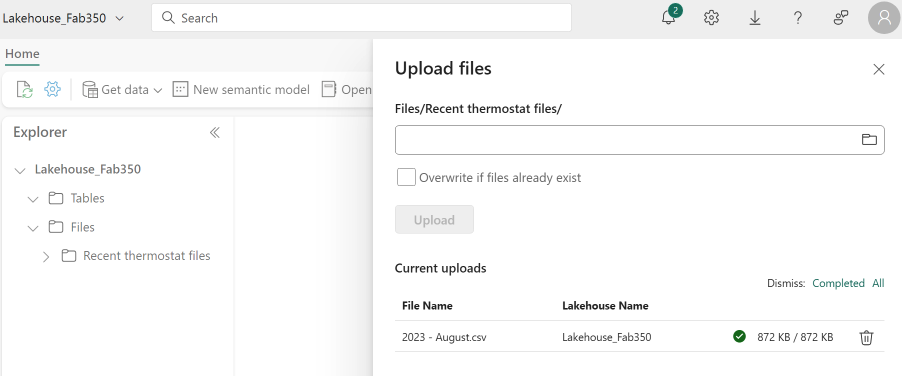

Click on the folder, then click on the file to view the content. Click on "Recent Thermostat files" in the Explorer pane.

Hover over "2023 - August.csv" and select the ellipsis that appears. Select Properties.

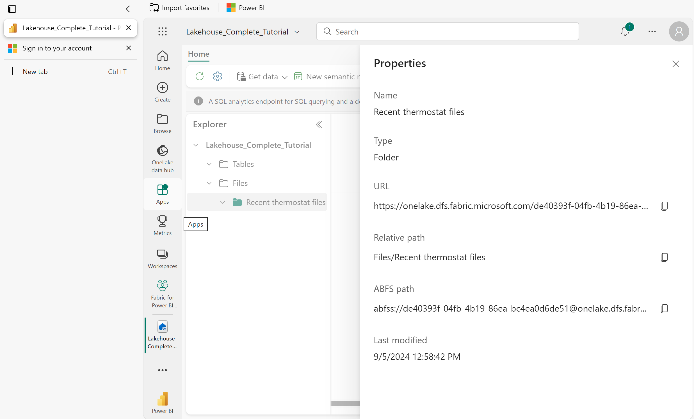

Note the URL that appears. This could be used with the Azure Data Lake Storage Gen2 (ADLS Gen2) connector in Power BI Desktop to build a report against this data, but we will use another mechanism.

Close the Properties pane.

## Move CSV to Delta tables

Hover over the CSV file, select the ellipsis, and click on "Load to Tables".


Select "New table" and name your table "thermostat_readings". Take the defaults for Column Header & Separator. Click the "Load" button.

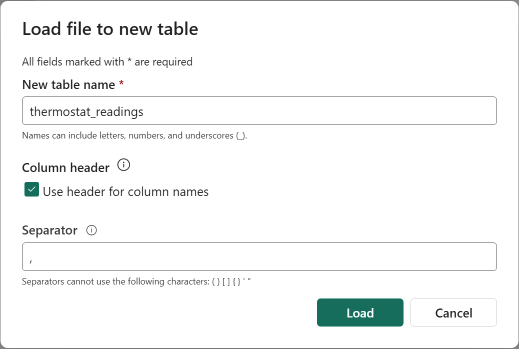

Loading will take a moment, and will load the data from the CSV into the Tables endpoint where it will be stored in parquet files using Delta to allow for transactional access and the SQL endpoint.

Open the Tables node. If it is empty, select refresh from the ribbon on the top of the page. Note the new table there with the small triangle icon. That icon indicates that the table is in Delta format.

Click on the new table and observe the preview (1000 rows). It will take a moment to initialize the Spark engine the first time, as this view is using a SQL query, not simply viewing the contents of a file.

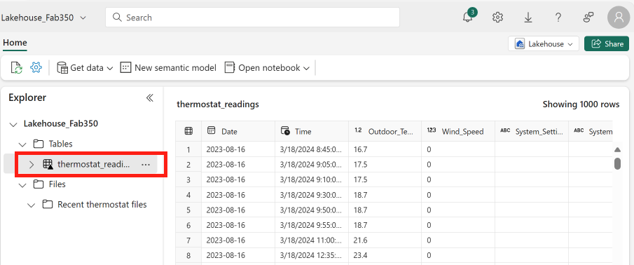

## Add table to the default semantic model

In the upper right hand corner of the table view, there is a dropdown button labeled "Lakehouse". This means that we are in the Lakehouse view of the table. We need to switch to the SQL endpoint view, so select it, and select "SQL analytics endpoint".

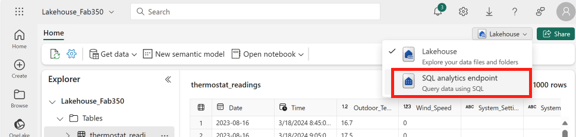

You will then be taken to the SQL analytics endpoint view. Click on the "Reporting" tab at the top of the ribbon, then click on the "Manage default semantic model" button in the ribbon. Finally, select the "thermostat_readings" table for inclusion in the default model, and click "Confirm".


> **Default Semantic Model vs New Semantic Model**
>
> There are things to consider with using the default semantic model that comes with a Lakehouse. It will always make sure that tables are updated. This helps to allow Power BI reports, in Direct Lake mode, reflect the most recent data.
>
> Creating a new semantic model will give you the option to control whether these automatic updates happen or not. In an production roll out, chances are that you will want to control when you point to the most recent data if you are doing a data load. Consider that the fact table may be updated first and then the dimensions. If you are leveraging automatic updates, this may lead to missing data within the report or confusing results. 

## Create Power BI report from the table (PBI Desktop)

Start Power BI Desktop. Log in with your Fabxxx@fabricconf.onmicrosoft.com ID. Create a new blank report.

Select the Get data button from the ribbon. Select the "Microsoft Fabric" blade. Choose "Lakehouses" and then click the "Connect" button.

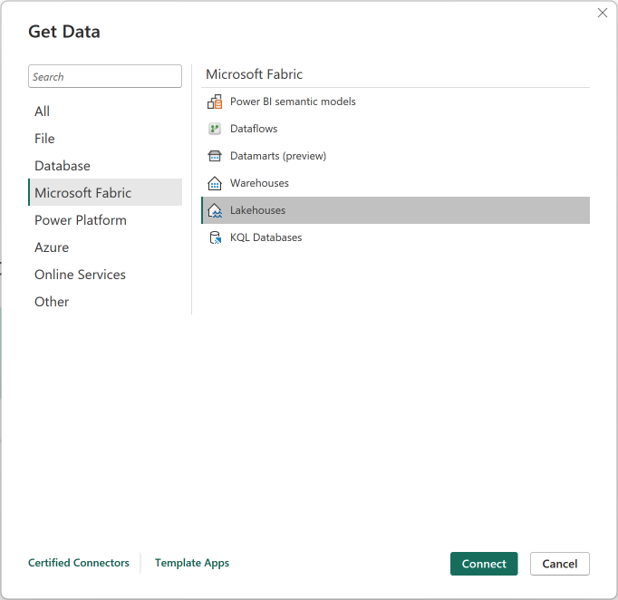

Your "Lakehouse_Fabxxx" lakehouse will appear in the list. Select it, and click "Connect" (not "Connect to SQL endpoint"). Notice that you did not need to authenticate, as your credentials were passed in automatically.

Notice that Power Query was not loaded, and the table created above appears automatically

Drag Outdoor Temperature and Time onto a line chart on the canvas. Notice that the sum of temperature is used, which we can change to average (as an implicit measure). We would prefer to use an explicit (calculated) measure as a best practice, but we haven't created any yet. We are connected to a remote semantic model as noted in the status bar at the bottom. This is a [Direct Lake](https://learn.microsoft.com/fabric/get-started/direct-lake-overview) connection. Also note the fact that there is no date hierarchy.


Close Power BI Desktop without saving

## Create a View for time intelligence

Open the "Fabric Workshop xxx" workspace in the service, and then open the "Lakehouse_Fabxxx" Lakehouse.

From the upper right hand corner, change the "Lakehouse" dropdown to "SQL analytics endpoint".

(Alternatively, you could select the lakehouse's SQL analytics endpoint from the workspace)

Select the "New visual query" button from the ribbon.

Drag the "thermostat_readings" table onto the canvas.

Select the "Manage columns" button from the ribbon, and click on Choose columns. Deselect all columns except Date, Time, Outdoor_Temp, and the columns starting with Cool_Stage and Heat_Stage. Click "OK".

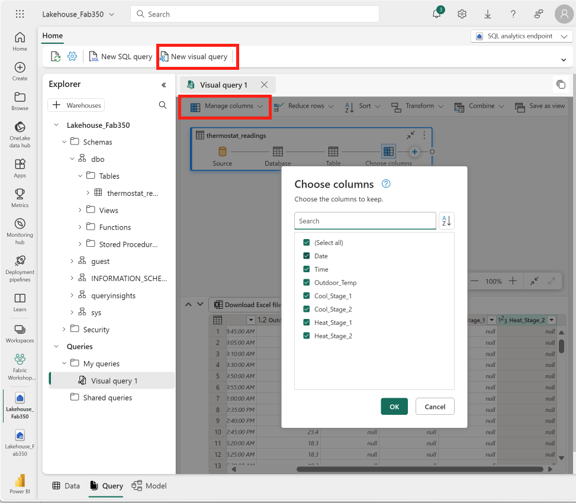

Today, we can't add columns using the visual editor, so click on "View SQL" from the view ribbon, then select "Edit SQL script" at the bottom.

Add lines to extract year, month and day into separate columns. Also, cast the Time column to Time instead of DateTime. *Note - if you are copying and pasting the code below, be sure to change the lakehouse name to your correct one*. When complete, the query should appear as follows:

```Sql
select [Date],
    Cast([Time] as Time) as [Time],
    [Outdoor_Temp],
    [Cool_Stage_1],
    [Cool_Stage_2],
    [Heat_Stage_1],
    [Heat_Stage_2],
    YEAR([Date]) as [Year],
    MONTH([Date]) as MonthNumber,
    DATENAME(Month,[Date]) as Month,
    DAY([Date]) as [Day]
from [Lakehouse_Fab350].[dbo].[thermostat_readings] as [$Table]
```

Run the query to ensure that it works. When satisfied, select the query text and click the "Save as view" button (next to the "Run" button). Name your view "vwThermostatReadings"

> **Best Practice: Star Schema**
>
> The above is a simple example of how we can create items and build out reports. In a production scenario, understand that Power BI reports work best with what is called a star schema table layout. A star schema pattern is an industry data warehousing concept and not limited to just Power BI. 
>
> A way to look at it would be if the above were split out where date attributes were broken out into it's own dimension table, and the temperature readings would bein a fact table. Related by the date itself.
>
> This allows you to quickly slice and dice within Power BI and improves model sizes which contribute to faster query and refresh times.
>
> Learn more: [Understanding star schema and the importance for Power BI](https://learn.microsoft.com/power-bi/guidance/star-schema)

## Edit the Semantic Model in the service

Click the Data tab at the bottom, and then the "Reporting" tab at the top, click the "Automatically update semantic model" button to add the newly created view to the semantic model.

Select the "vwThermostatReadings" view in the Explorer window.

Select the "New Measure" button from the ribbon. This allows you to create a new DAX measure from the SQL user interface

Create the following calculated measure:

```PlainText
Average Temperature = AVERAGE(vwThermostatReadings[Outdoor_Temp])
```

Change from the Data view to the model view by selecting "Model" on the bottom left corner of the window. The three choices available are Data, Query, and Model.

Select the"Default semantic model objects" tab at the bottom, then the "vwThermostatReadings" table from the model view. Scroll down to the bottom and note that "Average Temperature" has been added to the table.

Right click on the other table on the canvas, and select "Hide in report view". Repeat for any other tables, but not the view.

Select "Month" from the vwThermostatReadings table. In the properties pane on the right, open the advanced section, and choose MonthNumber in the "Sort by column" dropdown. This will allow the month name to be sorted chronologically.

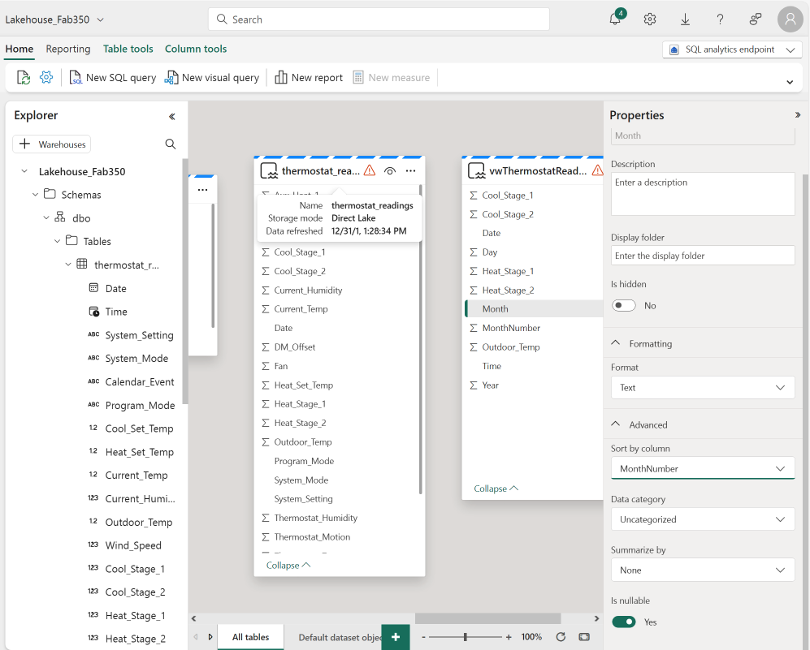

## Create Power BI report in the service

From the ribbon in the model view or the data view, select "New report".

Minimize the Filters pane.

Add a Line and Clustered column chart visual to the canvas.

Open the vwThermostatReadings table in the Data pane.

Add Cool_Stage_1, Cool_Stage_2, Heat_Stage_1, Heat_Stage_2 to the Column y-axis

Add Average Temperature to the Line y-axis

Drag Year, Month, and Day to the X axis (in order) well. Note that while it is not currently possible to create a hierarchy in the model, this will have the same effect

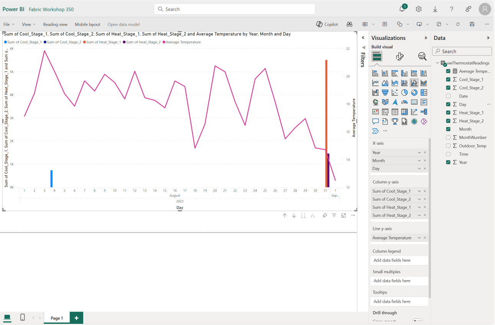

Save the report, and name it "Thermostat report 1". Ensure that you save it to the "Fabric Workshop xxx" workspace.

In this lab, you have ingested data, transformed it, modified the default model and bult a report, all without having to use Power BI Desktop.
