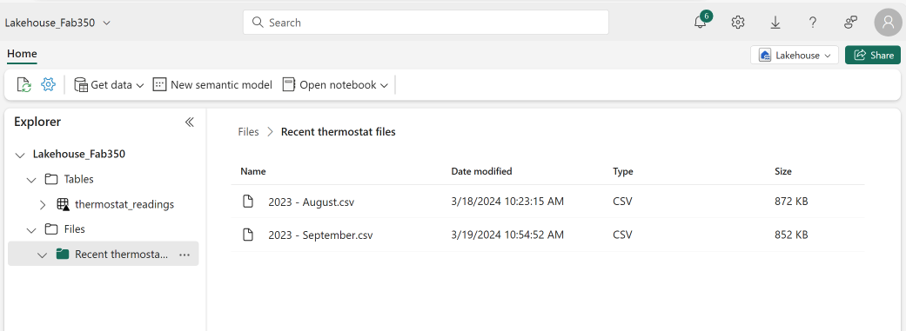
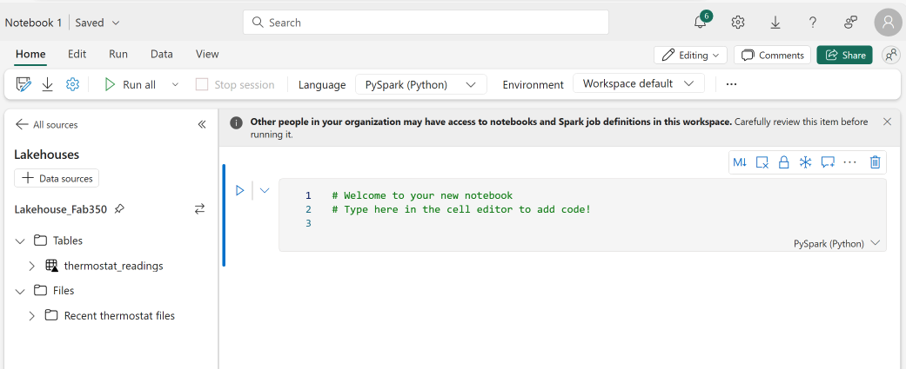
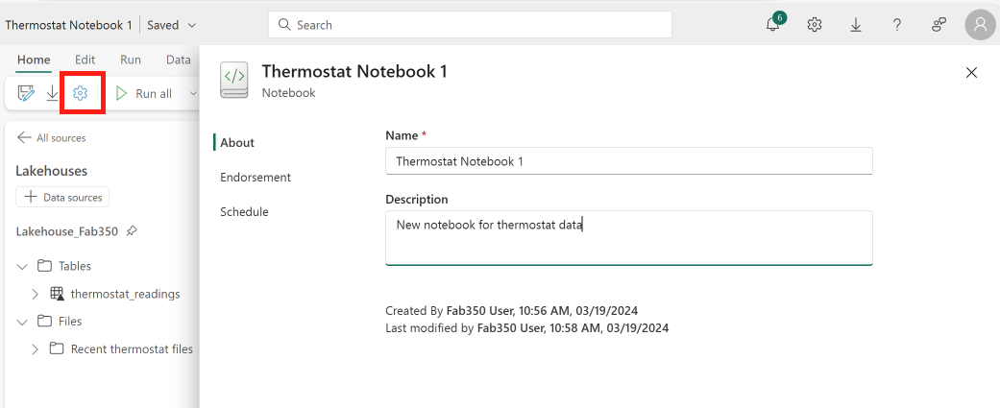
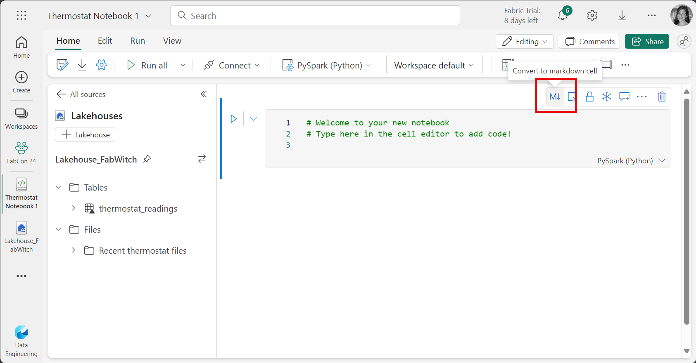
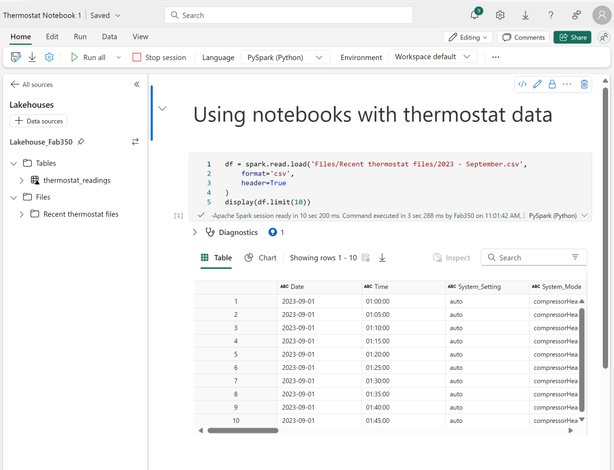
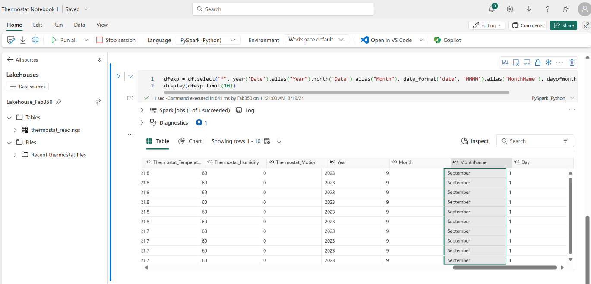
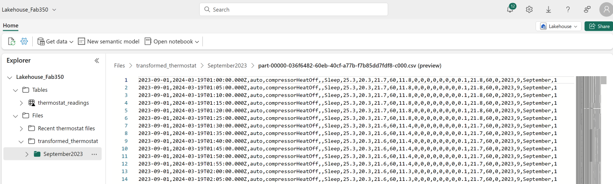

# Data Transformation with Notebooks and Spark

## Read **data with a** notebook

Navigate to the "Fabric Workshop xxx" workspace, and open the "Lakehouse_Fabxxx" lakehouse. Open the Files node, and the "Recent thermostat files" folder, and upload the file "2023 - September.csv" that you downloaded in the first module. Once the upload is complete you can close the Uploads window.



From the ribbon, click on the "Open notebook" button and select "New notebook".

Notice that the notebook is automatically connected to the lakehouse.



Make sure that PySpark is the selected language in the ribbon.

Click on the settings icon (gear) and give the notebook a name - "Thermostat Notebook 1". Once complete close the Settings window. Alternatively, you can click the notebook name in the top left corner and change the name there.



Click the Markdown icon (M with arrow on the right of the cell) to convert the cell from code to Markdown. Click the edit icon (pencil), delete the second line and change the content to "Using notebooks with thermostat data". The hashtag in markdown denotes a title style



Hover over the bottom of the cell and select the "+ Code" icon to add a new code cell.

Add the following code to the cell:

***Note: Items are case sensitive***

```Python
df = spark.read.load('Files/Recent thermostat files/2023 - September.csv',
    format='csv',
    header=True
)
display(df.limit(10))
```

Click the run arrow to the left of the cell. It may take several seconds to start the session the first time.



This code reads the data directly from the CSV file, not a delta table into a dataframe.

Hide the output by selecting the ellipsis to the left of the output cell and selecting "Hide output".

## Write **table** data with a notebook

Examine the dataframe by adding a new cell with the following code:

```Python
df.schema
```

Note that all fields have the String data type, which does not match the table that we created in exercise 1. If we want these schemas to match, which we do if we are to load this file into the pre-existing table, we cannot simply infer the schema.


We must explicitly declare the schema when we load the file. Load the file with an explicit schema by adding a new cell with the following code:

```Python
from pyspark.sql.types import *
from pyspark.sql.functions import *

thermoSchema = StructType([
StructField('Date', DateType()), 
StructField('Time', TimestampType()), StructField('System_Setting', StringType()), StructField('System_Mode', StringType()), StructField('Calendar_Event', StringType()), StructField('Program_Mode', StringType()), StructField('Cool_Set_Temp', DoubleType()), StructField('Heat_Set_Temp', DoubleType()), StructField('Current_Temp', DoubleType()), StructField('Current_Humidity', IntegerType()), StructField('Outdoor_Temp', DoubleType()), StructField('Wind_Speed', IntegerType()), StructField('Cool_Stage_1', IntegerType()), StructField('Cool_Stage_2', IntegerType()), StructField('Heat_Stage_1', IntegerType()), StructField('Heat_Stage_2', IntegerType()), StructField('Aux_Heat_1', IntegerType()), 
StructField('Fan', IntegerType()), 
StructField('DM_Offset', DoubleType()), StructField('Thermostat_Temperature', DoubleType()), StructField('Thermostat_Humidity', IntegerType()), StructField('Thermostat_Motion', IntegerType())
])

df = spark.read.load('Files/Recent thermostat files/2023 - September.csv',
    format='csv',
    schema=thermoSchema,
    header=True)
display(df.limit(10))

```

Run the cell, and then run the df.schema cell again above. You'll see that the schema now matches the delta table created in exercise 1.

We now want to add the data from September to the existing delta table (August). Add a new code cell, and enter the following code

```Python
df.write.format("delta").mode("append").save("Tables/thermostat_readings")
```

The "delta" directive indicated that the delta parquet format was to be used. The append mode directs the command to append the existing table, as opposed to overwriting it.

Navigate to the Power BI report created in exercise 1. Open it, and note that September's data has been added **without performing any data refresh steps**. Note that this may take a few minutes and may require a browser refresh, due to caching. You can also click the little "refresh" button on the top right of the report screen, right below the user picture.

## Write Files data with a notebook

We may want to use notebooks to simply transform data and write back to files in the lakehouse. Let's add time dimension columns to the data and save it.

Add a new code cell to the notebook.

Add the following code. This code takes our already loaded dataframe, and adds the 4 date fields that we created in the SQL view in exercise 1. Run the code and examine the output. Note the new columns on the far right of the in-memory result table.

```
dfexp = df.select("*", year('Date').alias("Year"),month('Date').alias("Month"), date_format('date', 'MMMM').alias("MonthName"), dayofmonth('Date').alias("Day"))
display(dfexp.limit(10))
```



To write this output back to the lakehouse, add a new code cell and add the following code:

```Python
dfexp.write.mode("overwrite").csv('Files/transformed_thermostat/September2023')
print ("Transformed data saved!")
```

When complete, exit the notebook and navigate back to the lakehouse. Open the "Files" folder and refresh it if necessary. You should see a folder named "transformed_thermostat" and in it a folder for September. In the September folder you will find a new CSV file. Select it to view the content. You should see the transformed version of the original input file.



In this section you have seen how a notebook can be used to extract, transform and load data from files into delta tables as well as into new data files.
