# Incremental transformation with DataFlow Gen 2 and Pipelines

Dataflows are familiar to Power BI users, as they are based on Power Query. Dataflows Gen2 are particularly interesting as they do not have to store their data in a proprietary manner as do Dataflows Gen1. Instead, they can output to lakehouses, KQL databases, and more. In this module, we'll use a Dataflow Gen2 to transform a thermostat file before using it to update lakehouse data with a pipeline.

> Learn more:
>
> * [What is Data Factory in Microsoft Fabric?](https://learn.microsoft.com/fabric/data-factory/data-factory-overview)
> * [Getting from Dataflow Generation 2 to Dataflow Generation 2](https://learn.microsoft.com/fabric/data-factory/dataflows-gen2-overview)

## Transforming the file

In the previous two exercises, we started with clean data. In the real world, these files arrive with some extra formatting that needs to be dealt with before loading.

Navigate to the "Fabric Workshop xxx" workspace, and open the "Lakehouse_Fabxxx" lakehouse. Open the Files node, and add a new folder named "Processing". Navigate to this folder and upload the file "2023 - October.csv" that you downloaded in the first exercise.

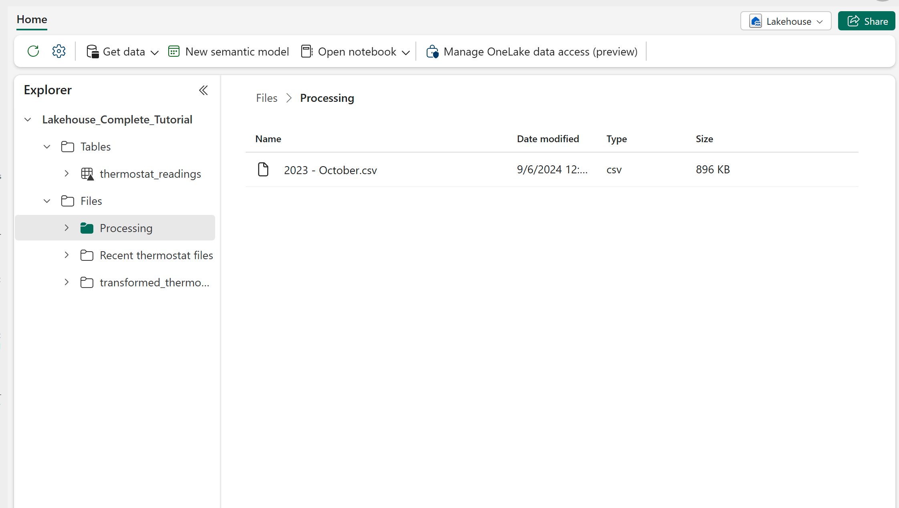

Navigate back to the "Fabric Workshop xxx" workspace, select the "+ New item" button from the ribbon. Next, select "Dataflow Gen2" from the "Get data" section. It may take a moment to respond to the click. If it takes too long, refresh your browser window.

Although our data is in a CSV file, it is not stored locally or in SharePoint, so do **NOT** select the "Import from a Text/CSV file" option on the main screen. Instead, select the "Get data" button from the ribbon, choose "More...", and then click on the "Recommended" tab in the OneLake data hub section. Select your lakehouse from the list.

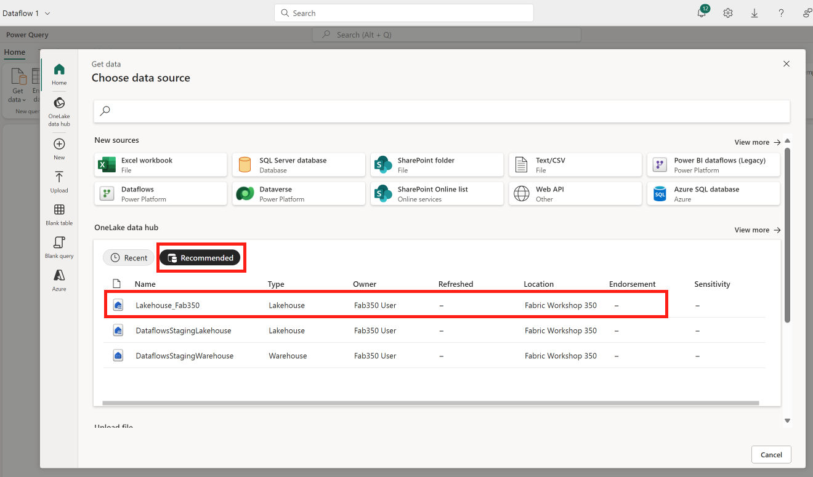

Expand the "Files" node. Select the "Processing" folder, then click on the "Create" button.

Select the Content column. Change its data type to "Binary" by clicking on the "ABC123" icon on the left side of the header, and selecting "Binary".

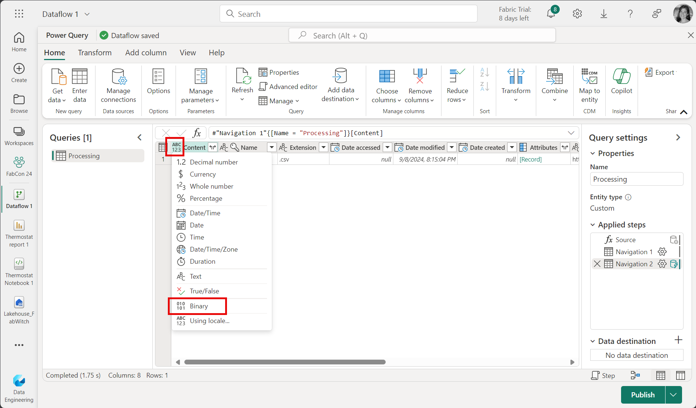

Click the "Combine" icon on the right side of the Content column header, or select "Combine - Combine files" from the ribbon. Click "OK" on the dialog box that pops up. This will build a function that will combine all files in the folder.

Note that we don't have proper column names or data types. We need to perform some Power Query magic to make this work. By making changes to the transform sample file, those changes will be repeated for every file that is subsequently combined.

Select the "Transform sample file" node in the "Queries" pane.

Click on the table cell in the upper left hand corner of the table. Select "Remove top rows". Enter 5 for the Number of rows, and click "OK".

Click on the same table icon, and select "Use first row as headers".

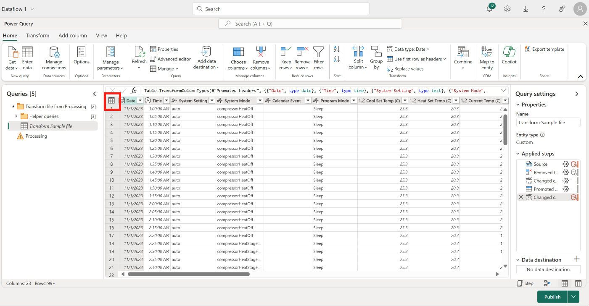

Select the "Processing" query in the "Queries" pane. Click the "Refresh" button in the ribbon to reprocess the files. You will see an error. This is due to the fact that we changed the column names for the sample file, so we need to set their types manually.

Delete the last step in the "Applied steps" window named "Changed column type 1". You will see your data again. Set the columns to their correct types as below (use the column header type icon, or the Data type button in the transform section of the ribbon - you can select multiple columns that will be the same time and update them together). Note that lakehouses do not support the Time data type. We will be outputting to a lakehouse delta table, so we need to change it to Date/Time instead.

| Column                     | Type           |
| -------------------------- | -------------- |
| Date                       | Date           |
| Time                       | Date/Time      |
| System Setting             | Text           |
| System Mode                | Text           |
| Calendar Event             | Text           |
| Program Mode               | Text           |
| Cool Set Temp (C)          | Decimal number |
| Heat Set Temp (C)          | Decimal number |
| Current Temp               | Decimal number |
| Current Humidity (%RH)     | Whole number   |
| Outdoor Temp (C)           | Decimal number |
| Wind Speed (km/h)          | Whole number   |
| Cool Stage 1 (sec)         | Whole number   |
| Cool Stage 2 (sec)         | Whole number   |
| Heat Stage 1 (sec)         | Whole number   |
| Heat Stage 2 (sec)         | Whole number   |
| Aux Heat 1 (sec)           | Whole number   |
| Fan (sec)                  | Whole number   |
| DM Offset                  | Decimal number |
| Thermostat Temperature (C) | Decimal number |
| Thermostat Humidity (%RH)  | Whole number   |
| Thermostat Motion          | Whole number   |

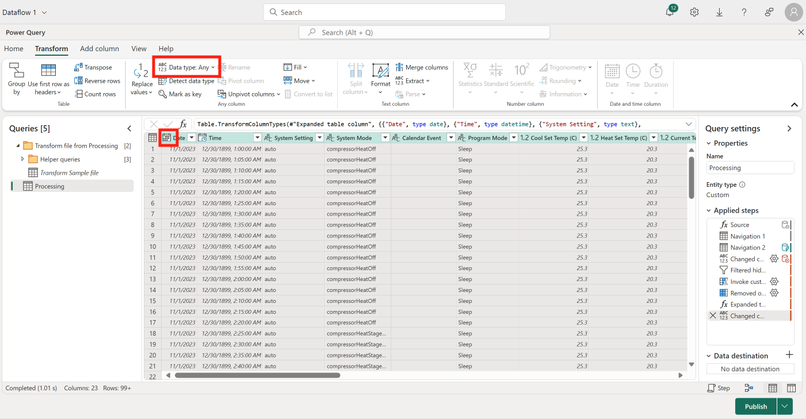

If you have a blank column as the last column, right-click the column header and select "Remove columns."

## Set the destination

Select the "+" icon beside "Data destination" from the bottom right part of the screen.

Select "Lakehouse".

Leave the "Lakehouse" connection selected, and select "Next".

Select the "Existing table" radio button. Expand the Lakehouse node, then the "Fabric Workshop xxx" node and finally the ""Lakehouse_Fabxxx" node. You should see the "thermostat_readings" table from the previous two tutorials. Select the table and click the "Next" button.

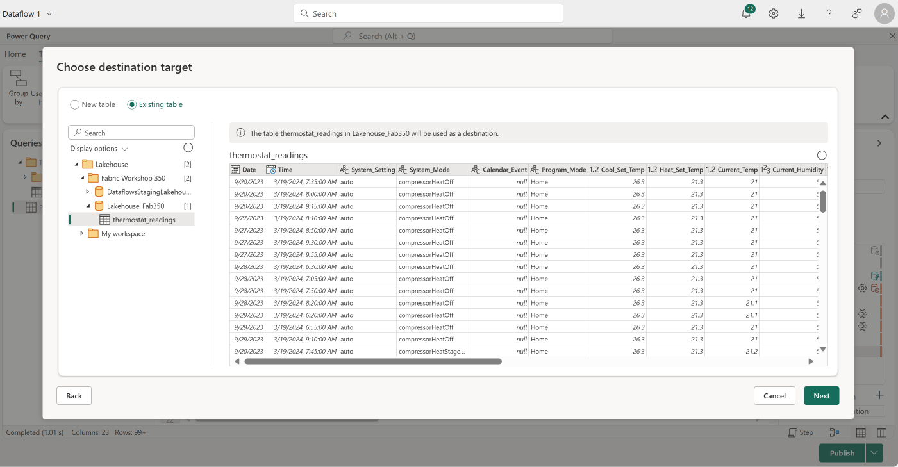

> **IMPORTANT** **- select the "Append" option. We will be adding data, not replacing it.**

The column names don't match up perfectly (in the earlier exercise they were modified to avoid spaces). Select the correct corresponding column for each destination field.

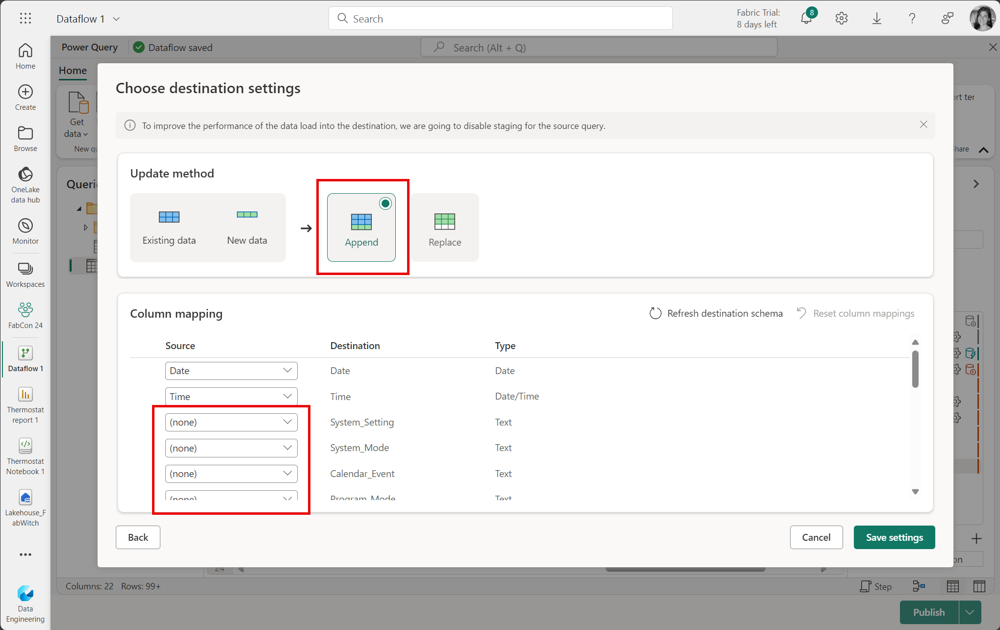

When ready, click the "Save settings" button on the bottom right.

Select the "Dataflow 1" dropdown in the upper left corner. Change the name to "Get new files."

Click the "Publish" button on the bottom right to publish your dataflow.

The dataflow will now run. When it is complete, the "Refreshed" value will be updated in the workspace. This may take a minute or two.

Open the "Thermostat report 1" report that you completed in an earlier exercise. Note that October data is now included. This is because the dataflow pushed the data from October into the delta table, and Power BI is using Direct Lake mode to connect to the data so no refresh is required. Drill up on the chart to get a monthly view. This works because the default semantic model is automatically kept up to date with the delta files.

Navigate to the Processing folder in your lakehouse and delete the file 2023 - October.csv. We don't want to append duplicate October data when we run the dataflow again.

## Automate file processing with a pipeline

Dataflows can be scheduled, but in our case, there is no point in re-adding the same data over and over again. Pipelines give us the ability to not only load data, but also to manipulate files. We'll build a pipeline to retrieve new files, load them to the lakehouse with the dataflow created above, and then archive those same files.

Navigate to the "Fabric Workshop xxx" workspace, and open the "Lakehouse_Fabxxx" lakehouse. Open the Files node, then add a new folder called "Input" and another folder called "Archives". Navigate to the new "Input" folder, and upload the files "2023 - November.csv" and "2023 - December.csv" that you downloaded in the first exercise. Close the upload window.

Navigate back to the "Fabric Workshop xxx" workspace, select the "+ New item" button from the ribbon. Next, select "Data pipeline" from the "Prepare data" section. Name it "Thermostat_file_processing"

Select the "Copy data assistant" tile on the main page.

Select your lakehouse from the OneLake data hub.

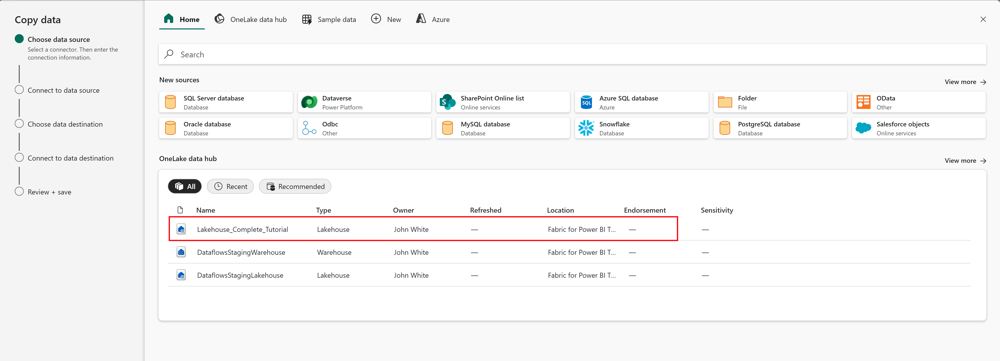

Select the "Files" radio button.

Select the "Input" folder, then the "Schema agnostic (binary copy)" checkbox. This allows the pipeline to work with files themselves, not the contents of the files. Click "Next".

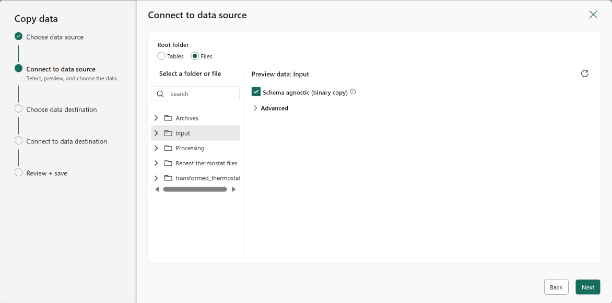

Select your lakehouse as the data destination.

Click Browse for the folder path, and select the "Processing" folder. Click "OK". This will write the files to the processing folder, where the Dataflow created above will be able to see them. Select "Preserve hierarchy" for the Copy behavior. Click "Next".

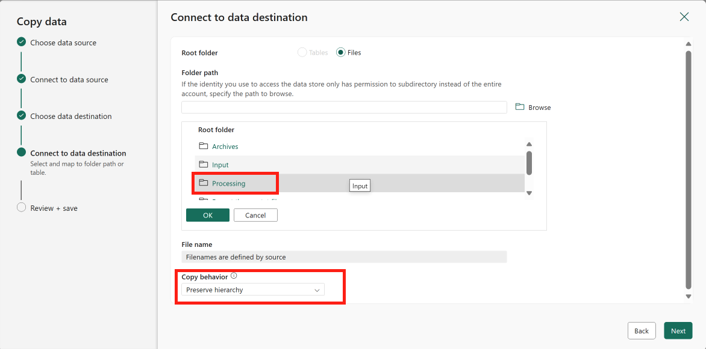

Leave the File format as "Binary" and click "Next".

Deselect "Start data transfer immediately" and click "OK".

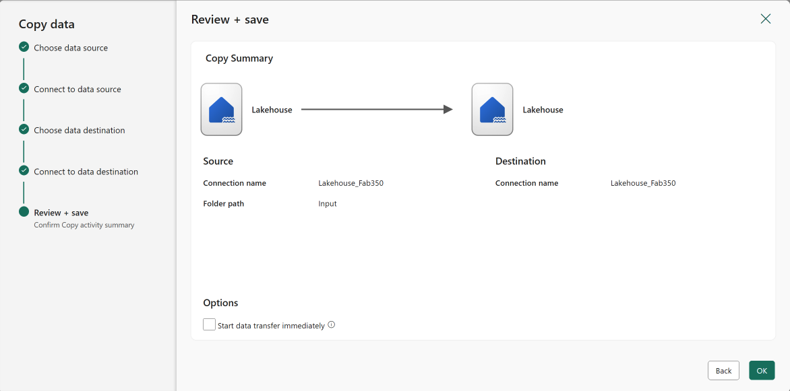

Select the "Copy data" action. Select the "Source" tab. Open the Advanced section and select the "Delete files after completion" checkbox.

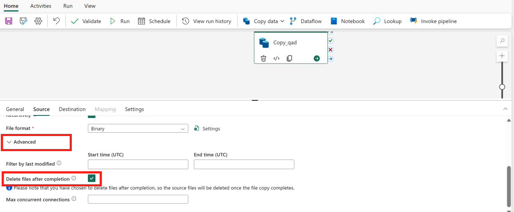

Select "Dataflow" from the ribbon to add a new dataflow action.

Connect the "On Completion" event from the Copy data activity to the input of the Dataflow activity.

Select the Dataflow activity, and set the name to "Load data".

Click the settings tab, and then select "Get new files" in the Dataflow field to use the dataflow you created earlier.

Add another "Copy data" activity (from the ribbon). Select "Add to canvas." Connect the "On success" event from the Dataflow activity to the new Copy data activity.

Select the new "Copy data" activity and configure it identically to the first one, using the "Processing" folder as the source, and the "Archives" folder as the destination.Use the "Browse" button to help select the folders. Make sure to select "Delete files after completion" in the Source settings (under the Advanced section).

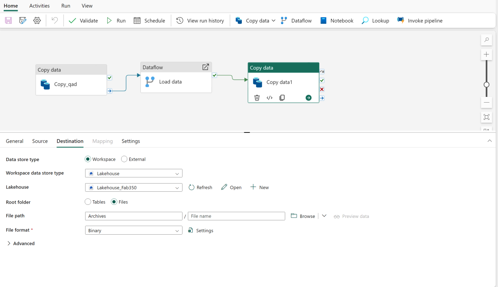Save the pipeline with the save icon in the ribbon, and then run the pipeline by selecting the "Run" button in the ribbon. Monitor the output in the output tab. You will see each step complete.

The pipeline will move the source file into the processing folder, run the dataflow to extract the data into the lakehouse, and then archive the file, removing it from the processing folder.

Open the Thermostat report 1 report from the earlier exercise. You should see November's and December's data loaded into it. Navigate to the Files folder in the lakehouse. The November and December data files should also be in the Archive folder.

This exercise demonstrates how both dataflows and pipelines can be used together or separately for low code, high value ETL operations.
