# Real-time Intelligence with Eventhouse

## Add a new Eventhouse and ingest data

Navigate to the "Fabric Workshop xxx" workspace and click the "+ New item" button from the ribbon. Scroll down to the "Real-Time Intelligence" section and select the "Eventhouse" tile. Alternatively, choosed the "Real-Time Intelligence" persona from the persona switcher in the bottom left corner of the window and select the "Eventhouse" tile in the "Recommended items to create" section.

Name the eventhouse "MyKusto" and click the "Create" button. Once it is created, click on the "MyKusto" database in the KQL databases section of the window.

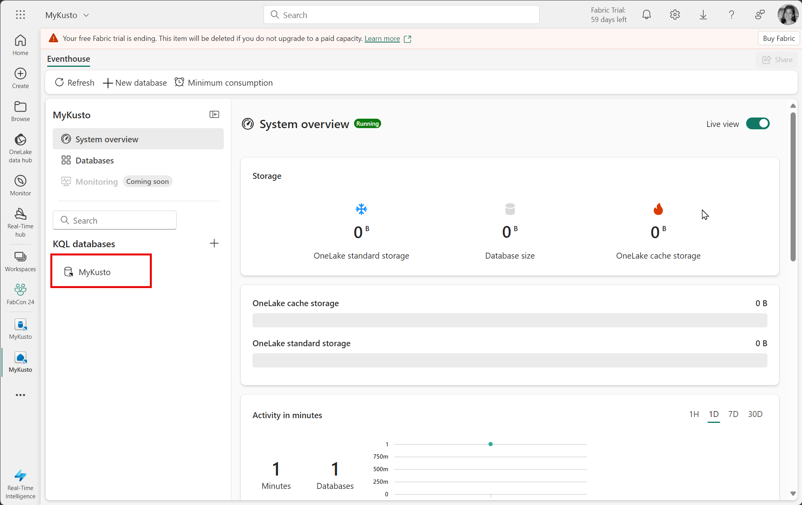

Add some sample data. Click on the "Sample Data" tile. and select "Automotive operations analytics". This is a truncated database of New York taxi operations over a two year period, and the largest provided sample data set. This will take a few moments to load.

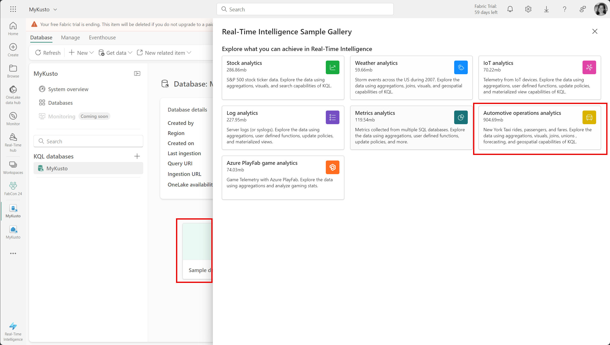

Expand the "Automotive" table to view the schema.

Click the "Explore your data" button in the upper right hand corner. A window will open with some sample queries.

Replace "YOUR_TABLE_HERE" with "Automotive" for the first two queries.

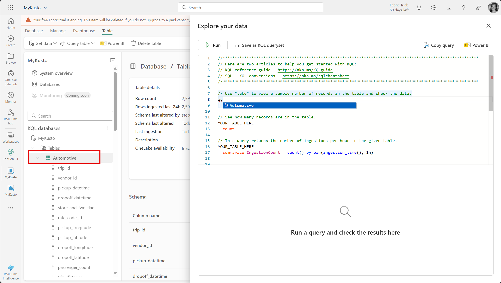

Highlight rows 8 and 9, and click the "Run" button. You will see a random selection of 100 records from the table.


Highlight rows 12 and 13 and click the "Run" button. You should see that there are over 2 million records in the table.

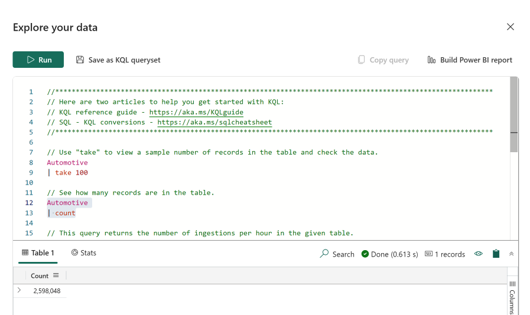

## Create a Query Set for multiple sharable queries

The data explorer is handy, but if you're working extensively with KQL, you will likely want to use a purpose built client like Azure Data Studio or Visual Studio Code or the Azure Data Explorer client. Within Fabric, the KQL Queryset is a sharable version of the Azure Data Explorer client.

Close the "Explore your data" window, and navigate back to the workspace. Click the "+ New item" button in the ribbon, scroll down to the "Track data" section, and select the KQL Queryset tile. Name it "Taxi Queries" and click "Create".

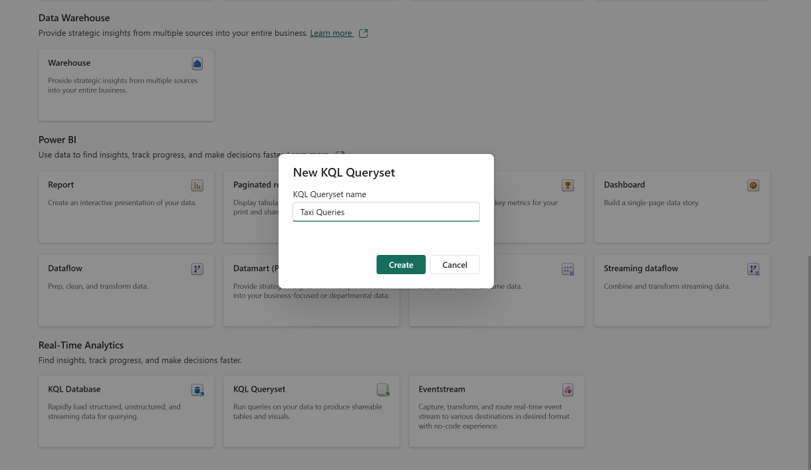

Select the"MyKusto" database created above, and click "Connect".

Delete the queries automatically added to the default tab. Note that you can add tabs to work with different queries efficiently, and when saved, others can work with this query set.

Add the following query that retrieves a number of metrics by day and borough:

```PlainText
Automotive
| summarize Fares = sum(fare_amount), Passengers = sum(passenger_count), distance = sum(trip_distance) by Day = bin(pickup_datetime,1d), pickup_boroname
```

The query summarizes fares, passengers, and distances by borough name. Click on the "Run" button to run the query, and note the time required to run in the results window. It should be around 1 second.

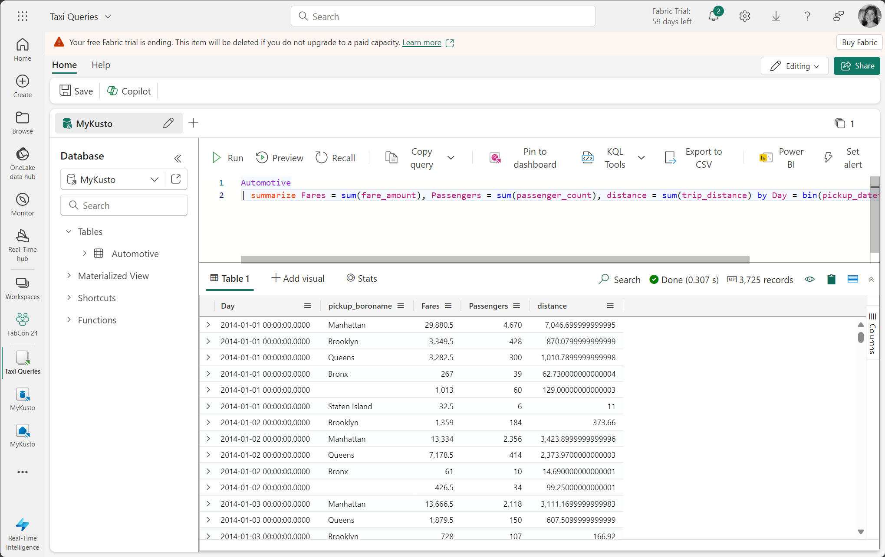

## Build a materialized view

While running a summarized query against 3 million rows of data is good, more complex queries with elements like joins, etc, and larger amounts of data can present a performance challenge. If these query patterns are common, it is a good idea to build a materialized view.

While still in the queryset, add a new tab and add in the following code:

```PlainText
.create async materialized-view with(backfill = true) FareSummary on table Automotive { 
Automotive
| summarize Fares = sum(fare_amount), Passengers = sum(passenger_count), distance = sum(trip_distance) by Day = bin(pickup_datetime,1d), pickup_boroname
}
```

The "async" directive tells Fabric to process this command in the background, which is necessary to use the "backfill=true" option. Backfill tells Fabric to include all current data in the materialized view - without it, the view will only contain new data after it is run. Click on the "Run" button in the ribbon. The result will be an OperationId. This Id can be used to query the status of the operation.

Wait a few seconds and then refresh the database in the left pane by selecting the database in the dropdown, and clicking the refresh icon.

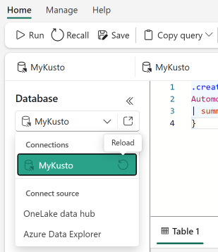

Open the "Materialized View" node and you will see the new "FareSummary" view. Open the "FareSummary" Materialized view to see the schema.

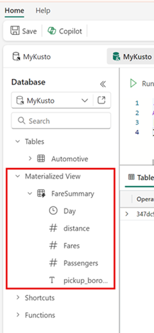

Open a new tab, and simply enter the name of the view by double clicking on it in the explorer view. Click on the "Run" button. The first run is initialization, so run it a second time. It should run in less than half the time that the original query ran. Also note the number of rows returned.

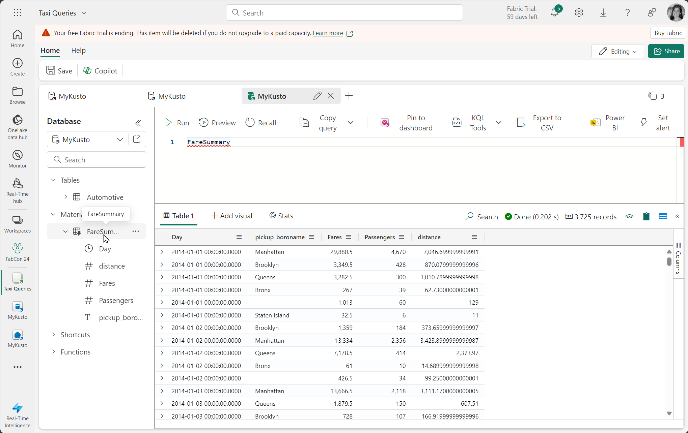

## Build a Power BI report

From the queryset, click on the "Power BI" button.

Close the filter pane, and add a stacked bar chart to the canvas. You may want to resize the chart to make it easier to see.

Add "pickup_boroname" to the Y-axis, and "Fares" to the X-axis.

Select File-Save and name the report NYCCabs. "My workspace" is selected by default. **Select the "Fabric Workshop xxx" workspace** and click "Continue". Close the Power BI window.

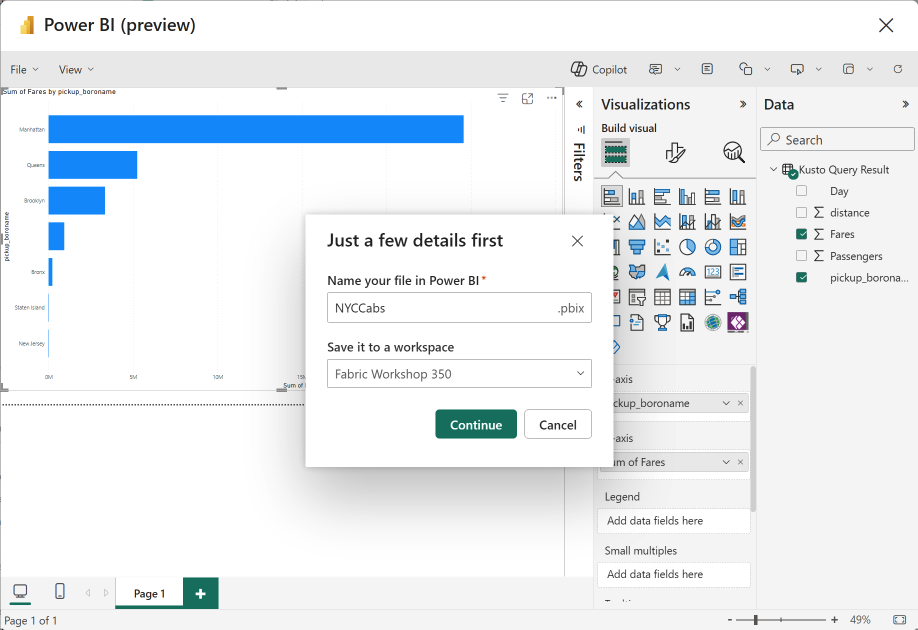

Navigate back to the "Fabric Workshop xxx" workspace. Note that there is both a report and a semantic model created. KQL data is not stored natively in OneLake (more on that below), so the semantic model is a DirectQuery (not Direct Lake) connection to the KQL data.

We need to allow model editing in a browser. Click on "Workspace settings" from the ribbon (this may be under an ellipsis). Open the "Power BI" blade and select "General". check the bottom checkbox to allow model editing.

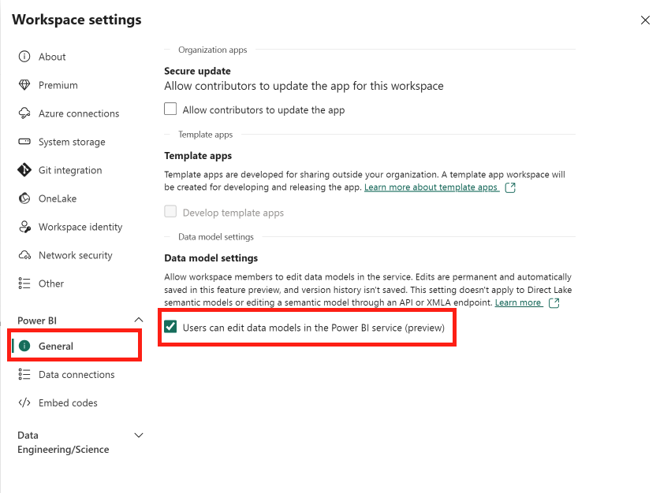

Close the settings window and navigate back to the workspace. Click on the "NYCCabs" semantic model.

Click the "Open data model" button in the ribbon.

From the ribbon, click the "New measure" button.

Enter the following in the editor:

```PlainText
Trips = COUNTROWS('Kusto Query Result')
```

Click "Enter" and make sure the new "Trips" measure appears in the Data section.

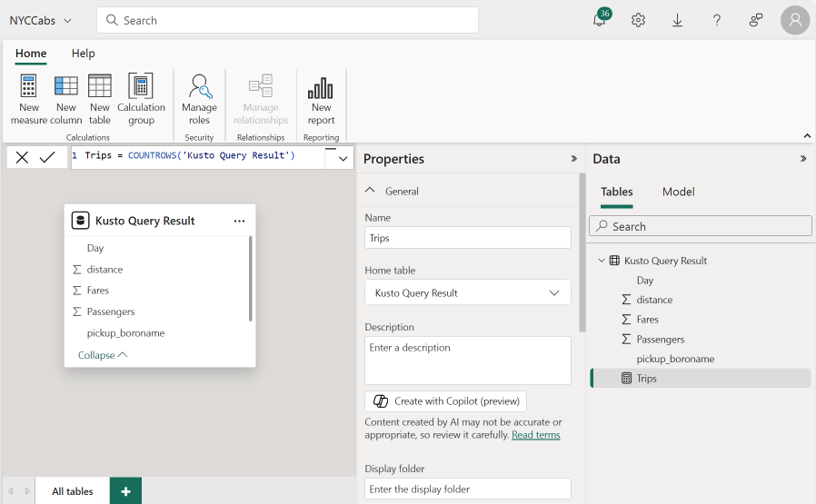

Navigate back to the workspace, and click on the NYCCabs report.

Click "Edit" in the ribbon. Add a new card visual to the report, and add the new "Trips" measure to its Fields.

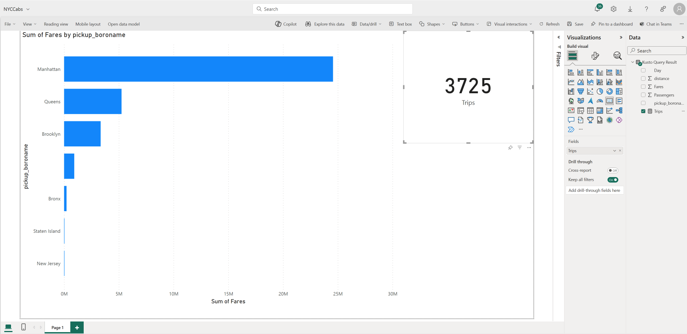

Save the report and navigate back to the workspace.

## Materialize KQL data in the lakehouse

As mentioned above, KQL does not store its data in OneLake natively. However, it can be mirrored into OneLake in a read only manner for integration with other systems.

Open the "MyKusto" KQL database (if you choose the MyKusto Eventhouse by accident, just click on the "MyKusto" database from the Eventhouse). Click the pencil icon beside "OneLake availability".

Set the value to "Active" and click "Done".

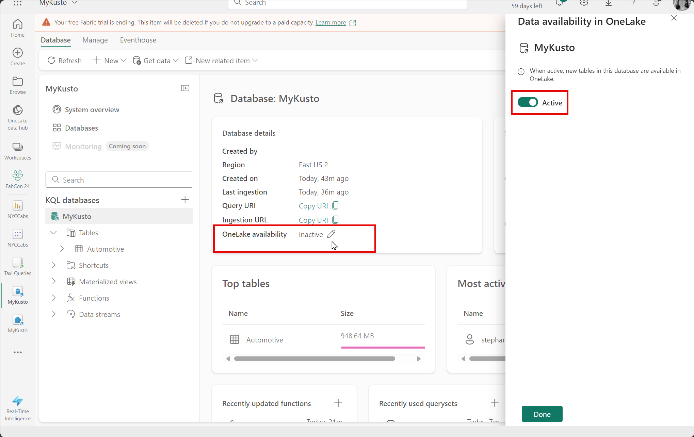

If the value still shows as inactive, refresh the screen.

> **OneLake availability could take time**
>
> Changing this setting will allow the data to show up in OneLake, but could take a bit of time to start populating. It could take several hours and then batches items.

Select the "Automotive" table. If "OneLake availability shows as "Inactive", activate it in the same manner as above.

Navigate back to the workspace, and open the "Lakehouse_Fabxxx" lakehouse.

From the ribbon, click on "Get data", and select "New shortcut".

Select the OneLake tile, and then select the "MyKusto" KQL database. Click "Next".

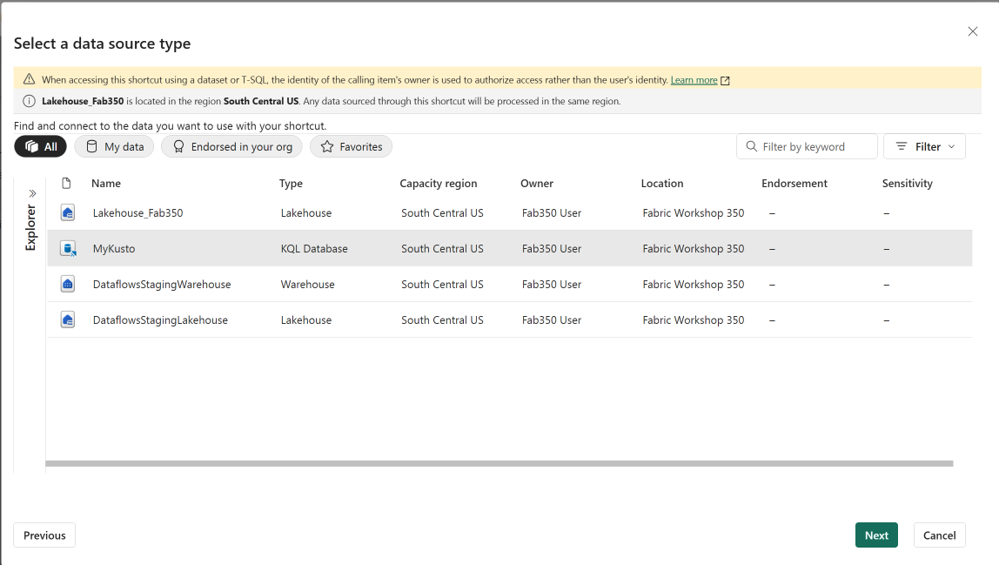

Expand the "Tables" node, and check the box next to the "Automotive" table. Click "Next".

Click the "Create" button, and then "Close". The "Automotive" table appears under the "Tables" node. It will likely appear empty, as the process of mirroring the KQL data into the lakehouse can take some time, but you will eventually see the KQL data displayed as a delta table named "Automotive" in the lakehouse. You may need to come back to this spot. 

From the lakehouse, select "Automotive". Click on the ellipsis to the right of "Automotive" and select "View files". These are the delta-parquet files behind the lakehouse table. (If the files above have not yet been loaded, use the "thermostat_readings" table instead to see its backing files).

> If you don't see any delta-parquet files, it's because the OneLake availability hasn't synced yet. This could take a bit of time.

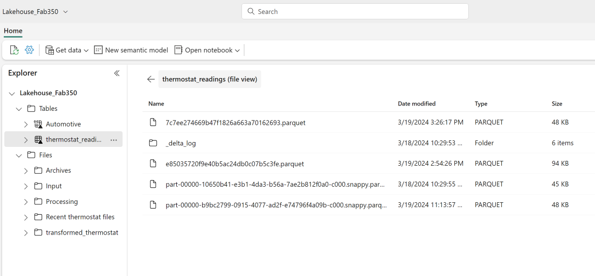

## Create an event stream and output to KQL and Lakehouse

Navigate to the "Fabric Workshop xxx" workspace and click the "+ New item" button from the ribbon. Scroll down to the "Real-Time Intelligence" section and select the "Eventstream" tile.

Name your Eventstream "BikesFeed". Click the "Create" button. It make take a few seconds for the screen to load.


Click on "New source" and select "Sample data". (This is a selection of sample data feeds provided by Microsoft for testing).

Name the source "Rental_Bikes" and select "Bicycles (Reflex compatible)" from the dropdown menu. Click the "Add" button.

Click on the "BikesFeed" tile in the middle and observe the Data preview. It may take a few moments to load.

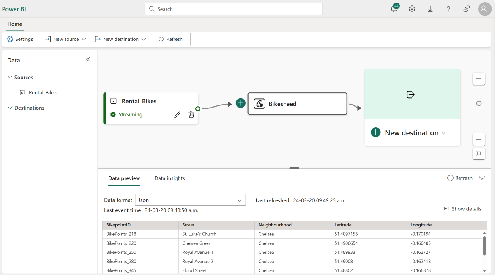

Click on the "New destination" tile and select "KQL Database".

Select "Event processing before ingestion", and the following configuration options.

* Destination name: BikesSummary
* Workspace: Fabric Workshop xxx
* KQL Database: MyKusto
* Destination table: Select the "Create New" link. Name the new table "BikesSummary".
* Input data format: Json

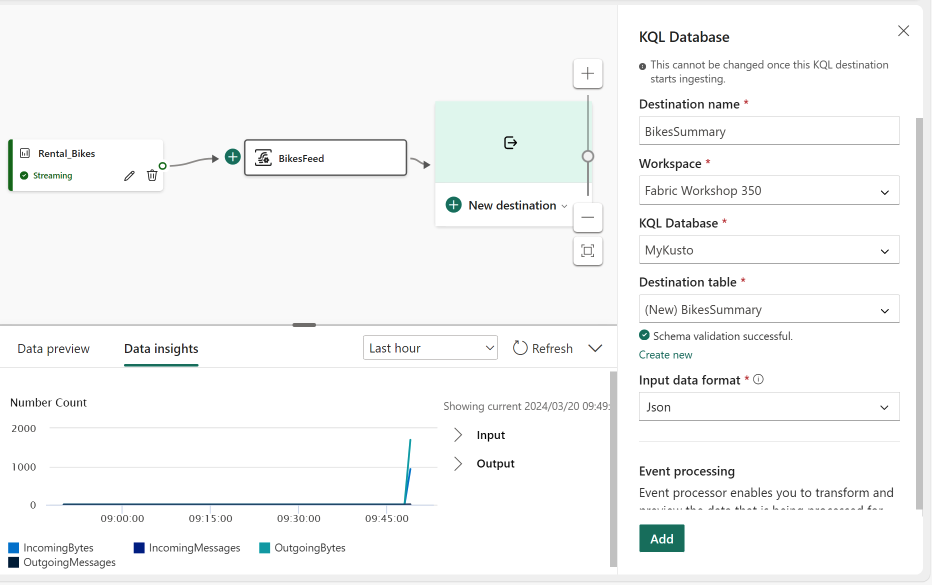

Click the "Open event processor" button at the bottom.

Select the line connecting the BikesFeed and KQLDatabase1    boxes and delete it.

From the ribbon, press the "Operations" button, and select "Group by".

Connect the "BikesFeed" source to the Group by action, and that action to the "KQLDatabase1" destination. You may need to zoom out to see all three boxes.

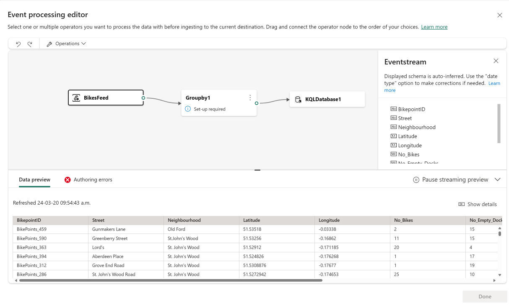

Click on the "Groupby1" action. Select the Average aggregation for the "No_Bikes" field, and click the "Add" button. Click on "+ Add aggregate function" and create another Average for the No_Empty_Docks" field.

Scroll down to the Settings section and select the "Neighbourhood" field to group the aggregations. Leave the time window as "Tumbling", and set the duration to 1 minute. Click the "Done" button in the "Group by" pane, and then "Done" in the editor window.

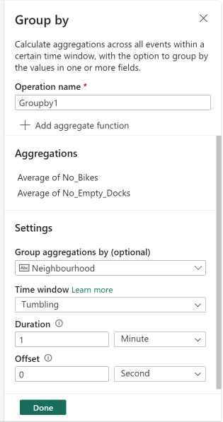

Finally, click the "Add" at the bottom. The destination table will be created, and data will begin flowing to it. Click on the "BikesSummary" node to see a preview of the streaming grouped data.

Click the "+" button to the right of the "BikesFeed" node. Select "Lakehouse" and fill in the following values:

* Destination name: BikesLive
* Workspace: Fabric Workshop xxx
* Lakehouse: Lakehouse_Fabxxx
* Delta table: Select the "Create New" link. Name the new table "BikesLive".
* Input data format: Json

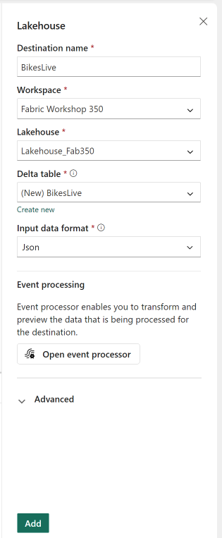

We will not process these events, so click on the "Add" button. The delta table will be created, and data will begin flowing.

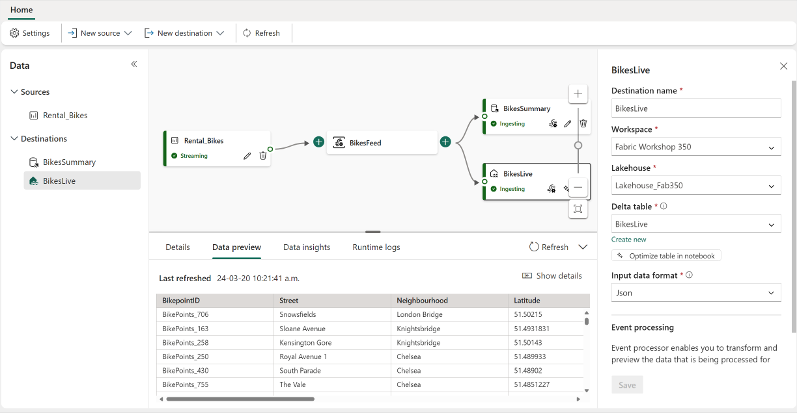

## Build a Power BI report from the lakehouse

Navigate back to the "Fabric Workshop xxx" workspace, and open the "Lakehouse_Fabxxx" lakehouse. Click the "BikesLive" table to see a preview of the data. Note that it make take a couple minutes for the table to appear.

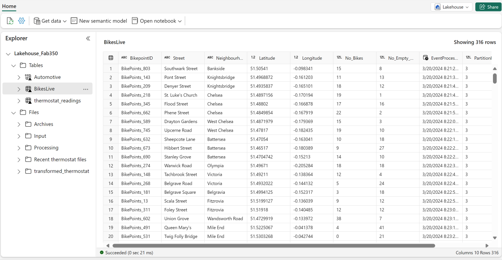

Change from "Lakehouse" to "SQL analytics endpoint" with the button in the upper right of the ribbon. Select the "BikesLive" table again. Hover over the "BikesLive" node, click the ellipsis, and select "Add to default semantic model". If you receive an error, repeat the process.

Click the "New measure" button in the Reporting tab of the ribbon. Add the following measure:

```PlainText
Latest (UTC) = MAX(BikesLive[EventProcessedUtcTime])
```

Select the "Model" tab at the bottom of the Explorer pane. Find the "BikesLive" table and click on the "Latest (UTC)" measure.

Change the value for "Format" to "Custom" and add the following Custom format in the box below:

```PlainText
yyyy-MM-dd hh:mm:ss
```

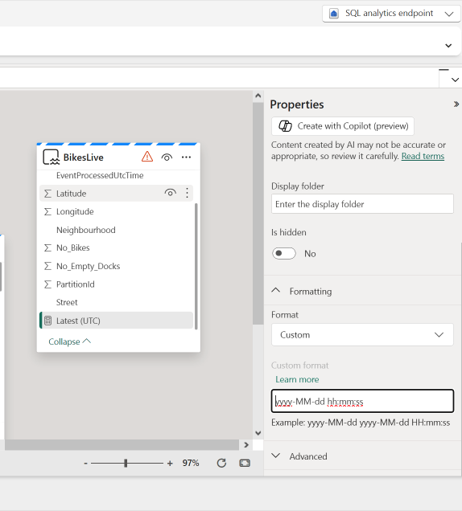

Click the "New report" button on the ribbon.

Open the "BikesLive" table in the "Data" pane on the right.

Add a new Card visual to the report canvas, and add the ***Latest (UTC)*** measure to it.

Add a table to the canvas, and add the following fields: EventProcessedUTCTime, Neighbourhood, No_Bikes, No_Empty_Docks

Change the Aggregation for No_Bikes and No_Empty_Docks to Average by using the dropdowns in the Visualizations pane. Click on the "EventProcessedUTCTime" column twice to sort it in reverse order.

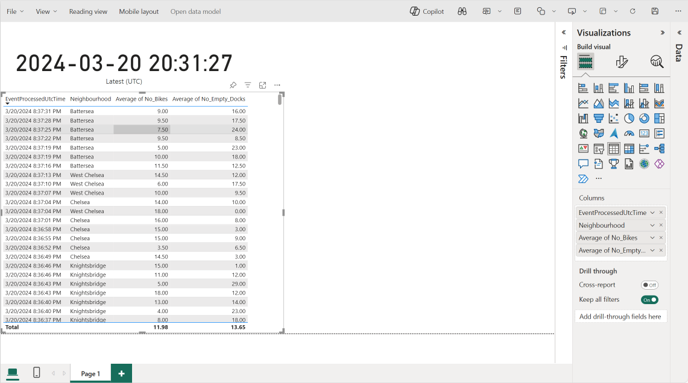

Refresh the report from the upper right corner of the ribbon. Note that the latest readings have (likely) changed.

Save the report, and name it "Bikes report in real time". Note that any time it is opened, it will display up to date data with no refresh.
