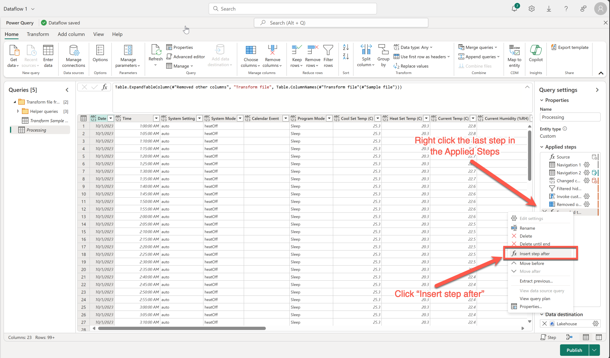
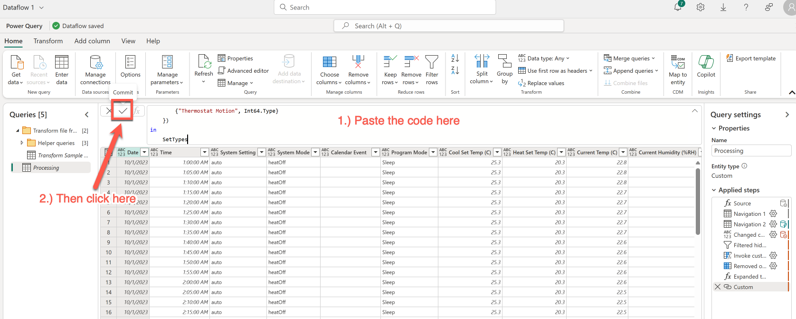

# Jason's Custom PQ step to set SetTypes

Rather than manually setting the types, or having Copilot do it for you, you can follow this side quest to add a custom Power Query step into the Applied Steps. Buyer beware... if this doesn't work for you simply revert to one of the other two methods. This will make it so that you don't have to make any changes manually. 



Copy this code:

```PowerQuery
let
    SetTypes = Table.TransformColumnTypes(#"Expanded table column",{
        {"Date", type date},
        {"Time", type datetime},
        {"System Setting", type text},
        {"System Mode", type text},
        {"Calendar Event", type text},
        {"Program Mode", type text},
        {"Cool Set Temp (C)", type number},
        {"Heat Set Temp (C)", type number},
        {"Current Temp (C)", type number},
        {"Current Humidity (%RH)", Int64.Type},
        {"Outdoor Temp (C)", type number},
        {"Wind Speed (km/h)", Int64.Type},
        {"Cool Stage 1 (sec)", Int64.Type},
        {"Cool Stage 2 (sec)", Int64.Type},
        {"Heat Stage 1 (sec)", Int64.Type},
        {"Heat Stage 2 (sec)", Int64.Type},
        {"Aux Heat 1 (sec)", Int64.Type},
        {"Fan (sec)", Int64.Type},
        {"DM Offset", type number},
        {"Thermostat Temperature (C)", type number},
        {"Thermostat Humidity (%RH)", Int64.Type},
        {"Thermostat Motion", Int64.Type}
    })
in
    SetTypes
```


Next go to the Power Query function bar and replace what is there with the code from above and then click the check mark to the left to commit the code.



For bonus points you can right click on the "Custom" step and rename it to something like "Changed types"

Return to the [Incremental transformation with DataFlow Gen 2 and Pipelines](../3.%20Incremental%20transformation%20with%20DataFlow%20Gen%202%20and%20Pipelines.md) lab already in progress.